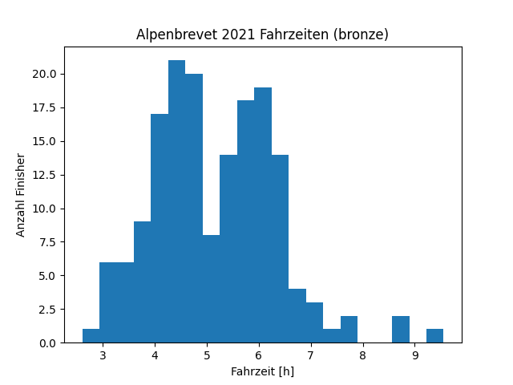
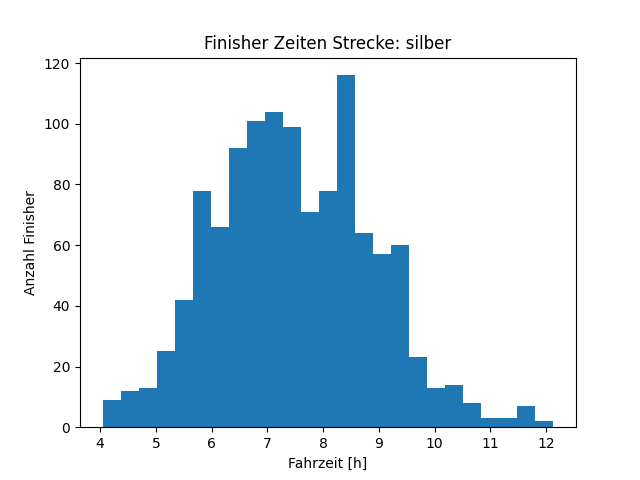
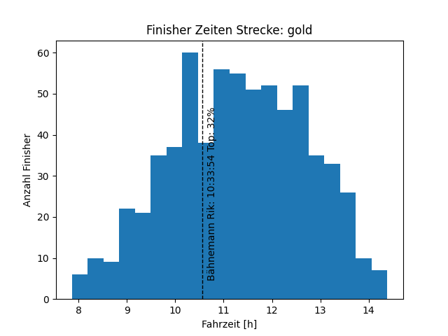
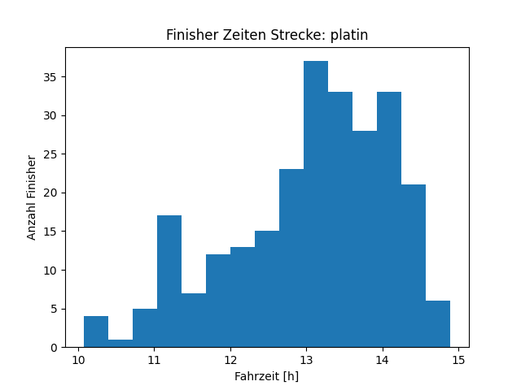

# alpenbrevet
Alpenbrevet is not a competition and thus there is no official ranking of the finishing times. 
If you are still interested how your performance compares to the starter field, e.g., you want to know if you could compete in the Platin edition, this script gives you some information.
The python script evaluates your own bike marathon time among Alpenbrevet 2021 participants.

# Results



# How to rank yourself
Change your preferences in [stats.py](stats.py#L8-L10)
```
# Set your preferences here.
strecke = 'gold'
start_nr = 1097
```

Then run the script
```
python3 stats.py
```

Example output:


```
Anmeldungen gold: 945
Starter gold: 755
Finisher gold: 749
Vor Kontrollschluss am letzten Checkpoint gold (Oberalp): 661


Top 3: 
                    Name    Jg  Startnr Fahrzeit
1       Paaske Roar Lava  86.0   2780.0  7:51:37
2  Schaufelberger Markus  78.0   3069.0  7:57:35
3         Van Rijt Geert  87.0   3580.0  8:05:55


Lantern Rouge: 
               Name    Jg  Startnr  Fahrzeit
661  Brunold Debora  94.0   1334.0  14:23:12


Yours: 
              Name    Jg  Startnr  Fahrzeit
216  Bähnemann Rik  90.0   1097.0  10:33:54

Congratulations, you arrived 216 out of 661 and in the top 33% of all finishers that passed the last checkpoint (Oberalp) in time!
```

# Dependencies
```
pip3 install tabula pandas matplotlib math
```
