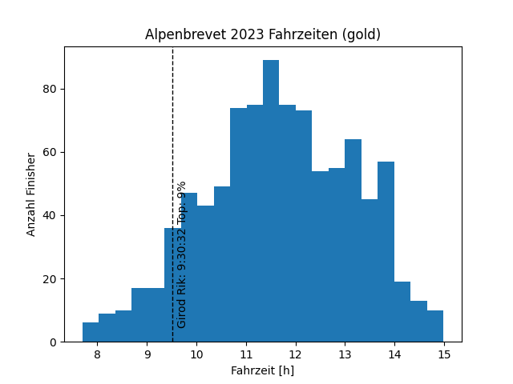

# alpenbrevet
Python script to evaluate your own bike marathon time among Alpenbrevet 2021 participants

# How to
Change your preferences in [stats.py](stats.py#L7-L9)
```
# Set your preferences here.
strecke = 'gold'
start_nr = 1097
```

Then run the script
```
python3 stats.py
```

Example output:



```
Anmeldungen gold: 945
Starter gold: 755
Finisher gold: 749
Letzter Checkpoint gold (Oberalp): 661


Top 3: 
                      Name    Jg  Startnr Fahrzeit
446       Paaske Roar Lava  86.0   2780.0  7:51:37
515  Schaufelberger Markus  78.0   3069.0  7:57:35
639         Van Rijt Geert  87.0   3580.0  8:05:55


Lantern Rouge: 
              Name    Jg  Startnr  Fahrzeit
72  Brunold Debora  94.0   1334.0  14:23:12


Yours: 
             Name    Jg  Startnr  Fahrzeit
22  Bähnemann Rik  90.0   1097.0  10:33:54

Congratulations, you are in the top 33% of all finishers that passed the last checkpoint (Oberalp) in time!
```

# Dependencies
```
pip3 install tabula pandas matplotlib math
```
